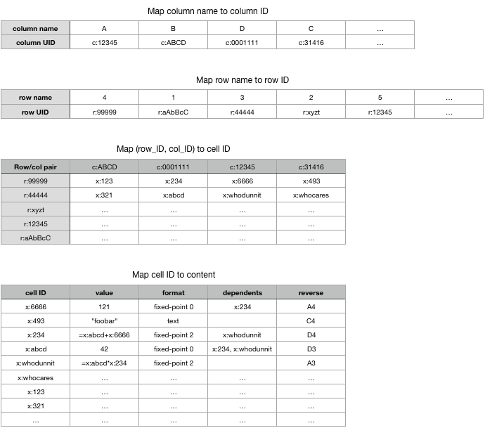

# Refactoring Concordant Spreadsheet 
Marc & Ludovic // 
18 March 2020

The Concordant spreadsheet is currently used only for the BASF lab-book, but it will be beneficial to demonstrate that we can support a fully-functional spreadsheet using CRDTs.
In particular, the Concordant Spreadsheet should support concurrent access to all the usual spreadsheet operations:

 * Setting the value of a cell, with either a value, a formula, or Null (i.e., deleting).
 * Automatic update of cells whose formula refers to an updated cell (directly or transitively).
 * Setting the formatting attributes of a cell.
 * Detecting circular formulas.
 * Adding and removing a whole column, a whole row, or an individual cell.  (Removing is functionally equivalent to setting to Null.)
 * Support for standard formulas (e.g. =SUM, etc.).
 * In formulas, support for both logical row/column identifiers (e.g. =SUM(A1, A10)) or grid-based (=SUM (\$A\$1, \$A\$10)).
 * Undo

The software must be safe, i.e., it must not lose updates and it must perform correct computations.
We are interested in demonstrating distribution, concurrency, scalability and persistence.
Performance is important, but secondary to the above objectives.

The implementation should aim to limit the size of metadata and tombstones, and garbage-collect when possible.

A "nice-to-have" feature is the ability to set the name of a row or column, and use such names in a formula (as in Apple Numbers).  For instance I can name columns as "Last\_Name", "First\_Name", "DOB", and lines "CEO," "CTO," "Lead Developer"; and refer to them in formulas e.g. "=CONCAT(First\_Name.CEO, " ", Last\_Name.CEO)"

## Some useful resources

* [StackExchange discussion](https://softwareengineering.stackexchange.com/questions/219298/what-are-the-data-structures-behind-a-spreadsheet)
* [Another StackExchange discussion; scroll down to "When designing..."](https://stackoverflow.com/questions/5052797/spreadsheet-data-linked-list-or-hashmap)
* [Spreadsheet assignment, no UI](https://web.cs.wpi.edu/~cs2102/b12/Assignments/spreadsheets.html)
* [Full spreadsheet program in Scheme](https://people.eecs.berkeley.edu/~bh/ssch25/spread-implement.html)
* [OpenOffice sources (very complex)](https://openoffice.apache.org/source.html)
* [How to compute the name of the next column](https://stackoverflow.com/questions/12504042/what-is-a-method-that-can-be-used-to-increment-letters/34483399#34483399)

## Commutativity

Every pair of operations transmitted between replicas must commute.
If there are $n$ operations, the designer must consider $n^2$ cases of commutativity.
Therefore, it is useful restrict the app to a very limited repertoire of basic operations, which are possibly composed into more complex high-level actions.

In the spreadsheet, the base operations are the following:

* Assign value to a single cell; assign a cell's formatting attributes.
* Insert row/column.
* Delete row/column.  As we see later, we add an undelete operation.
* Possibly, move row/col (see discussion below).

Other operations are built as combinations of the above; for instance, Move might be implemented as copy-delete-paste.

Copying to / pasting from clipboard are local operations, not transmitted to other replicas.

Value propagation is local: only the update to the origin cell is transmitted and persisted; each replica maintains its own local propagation graph and performs value propagation locally. 

Undo is in reverse chronological order, and local (I can undo my own recent operations, not anyone else's).
Undo is implemented as generating the opposite operation (insert column --> delete column; delete column --> undelete column).
Undeleting resurrects col/row.
A user can undelete something deleted by another user.

### Discussion

#### Concurrent *delete || update*
Consider the situation where one user deletes a row/col, and another user concurrently updates a cell in that row/col (or any equivalent action, such as updating a perpendicular col/row).
If merging removes the row/col, then the concurrent update is lost; this is often considered undesirable.
A tempting approach is an "update-resurrects" semantics, i.e., merging the concurrent update resurrects the deleted row/col.
However this is also weird (e.g., a row/col that was copy-pasted now appears twice).
A simpler semantics is "delete-wins" and enabling the users to manually undelete the deleted row/col.

#### Concurrent *move*

The semantics of moving a whole row/col to another location is problematic.

 * If move is implemented as the combination copy-insert-paste-delete (which not atomic), then any dependent formula becomes invalid.
This is undesirable.
Furthermore, if combined with update-resurrects, a moved row/col can appear in two locations (the new location and the resurrected one).
 * If move is considered a base operation, commutativity is problematic.  For instance, the operations *move col* vs *update row* do not commute at the cell level.

If two users concurrently move the same row/col to different positions, several resolution sematnics are possible:

* leftmost/topmost wins
* LWW
* original position wins, i.e., row/col returns to where it started from.

The least disruptive is probably "original position wins".

Note that even if there is no explicit move operation, inserting or deleting a row/col implicitly moves all the ones that come after it.

## Current design

(Ludo, je te laisse remplir cette partie)

(Description API + strcutres de données)

(Avantages et inconvénients)

## Proposed approach

### Concurrency

To limit concurency issues, each row, column and cell has an (internal, not visible outside the implementation) unique indentifier.  (To aid with debugging, a row, column, or cell identifier starts with *R:, C: or X:* respectively.)
The application maintains the mappings from user-visible identifier to unique identifier, and back.

A cell is a register that contains either Null (equivalent to non-existent cell), a string value (starting with a double-quote), a numeric value (starting with a digit), or a formula (starting with "*=*").  The only mutating operation on a cell is "assign" (no "increment" for numerics.)

* To support concurrent updates, the cell is a multi-value register (MVR).  When a cell-MVR has multiple arms, this shows up as a special "conflict" icon in the user interface.  The user is required to assign the cell to resolve the conflict.  
* A formula that depends on a conflicted cell shows up in the UI as a special "cannot be computed" icon.
* If two arms have the same value, it may be beneficial to merge them transparently, without user involvement.

A cell has an attached formatting attribute (e.g. string, fixed-point, etc.).  Format is a Last-Writer-Wins (LWW) register.
Formatting the cell's value into the UI is a local operation.

Each col/row has a "live" marker and an associated timestamp.
If false, the col/row is considered deleted, but is not deallocated.
Deleting or undeleting sets the marker and the timestamp.
Concurrency conflicts between delete and undelete are LWW, thanks to the associated timestamp.
When a row/col is deleted, all of its cells are unaccessible, and any formula that depends on such a deleted cell is invalid (shows up as "cannot be computed" icon). 

See also the "Commutativity / Discussion" section above.

### Base vs derived data items

The following *base* data items are persistent and are propagated between replicas.
We need to worry about concurrency between updates to base items only:

* Cell value.
* Cell format.
* In a formula: the unique IDs of the row/col/cell(s) that it depends upon + "absolute" marker (\$)
* Row/col:
  * ordering
  * unique identifier
  * live marker + unique timestamp

The following data items are *derived* from the base: they are local to each replica, non-persistent, and considered as cached hints only:

* Row/col/cell/formula label (*A, B, 1, 2*): derived from its position in the row/col order.
* In a formula: the row/col label(s) that it depends upon (*=A1+B2*): same as above.
* Update graph: for each cell, the cells that depend on it (via formula): derived from formulas.

In case of concurrent updates to a derived data item whose result is ambiguous, it's best to just recompute it from scratch.
In the update graph, it may be more efficient to allow false positives.

Finally, the following data items remain local to a replica:

* Clipboard
* Undo stack

### Limiting memory overhead

[[TODO]]
Do not allocate any data to a row/col/cell that has not been assigned a value.

Cannot deallocate content of a row/col/cell that has been deleted because it might be undeleted.
Can deallocate when delete is causally stable.

[[TODO] 
MVR ==> version vector or equivalent.  Use Baquero's map design = shared VV for the whole map + timestamp per cell.

[[TODO]]
Garbage-collect deleted cells/rows/columns.

[[TODO]]
When multiple cells have the same content or attribute, point to a shared object + reference count.

### Main data structures

[[TODO]]

There are two levels of indirection:

* Map column (resp. row) positions/UI names such as *A, B, C* (resp. *1, 2, 3*) to row (resp. column) unique identifiers of the form "*r:NNNN*" (resp. "*c:NNNN*").
* Map $(column\_ID,row\_ID)$ pairs to cell identifiers, of the form "*x:NNNNN*".
* Map cell identifiers to cell content, i.e., value, format attribute, and dependent.

Each of the first level structures (map position to UID) is best implemented as a list, e.g., with RGA.
Alternatively, if RGA is not available, it can be implemented as a map whose key is a *unique* value indicating its relative position (e.g., cols A, A.a, A.b, A.b_1).
This approach should be avoided.

### Support for row/col/cell names in formulas

[[TODO: 
Grid-based names: \$B\$2 refers to a specific location in the spreadsheet grid, even as the grid changes.
For instance, if a column is inserted between A and B, the new column is now called B, the old B is renamed to C, and \$B now refers to the new column B.
Grid-based names are relatively rare but must be supported.
:ENDTODO]]

Logical names: B2 refers to a specific cell, even as its location in the grid changes.
For instance, if a column is inserted between A and B, the old B is renamed to C, and any formula containing "B" is automatically updated to refer to "C".
Logical names are the common case.

In our proposal, a row or column name (as visible in the UI) is replaced internally by the corresponding unique identifier.  Thus, when the corresponding row, column or cell moves (either because the preceding row/col is deleted, or because of an explicit move operation), the data structure does not need to be updated.
Issues:

* How do we deal with ranges?  E.g. =SUM(A1:A5): unroll, replace with =SUM(A1,A2,A3,A4,A5)?  How do we update the list if inserting a new row between 1 and 5?
* Need to translate back and forth between UI names and unique IDs ==> need to maintain reverse mapping, update it atomically with row/col changes.

### Propagating updates through formulas
[[TODO]]
Maintain a graph: a cell points to the cells that depend on it.  When updating cell, send events downstream the graph.

Yell if the graph is circular.

### Complexity
[[TODO]]
Can we simplify the problem by restricitng the features?

Some complex operations require atomicity.  Need transactions with at least snapshot property; hopefully total order updates not required.

